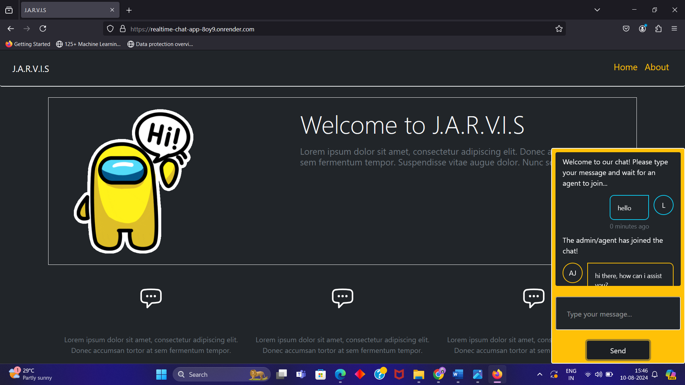
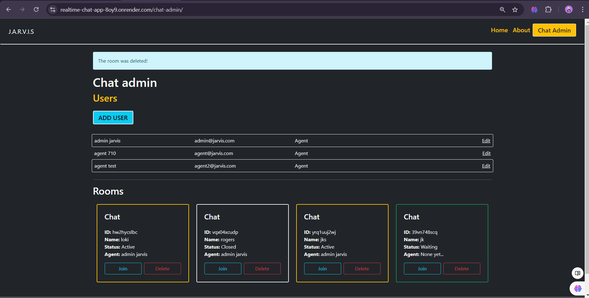
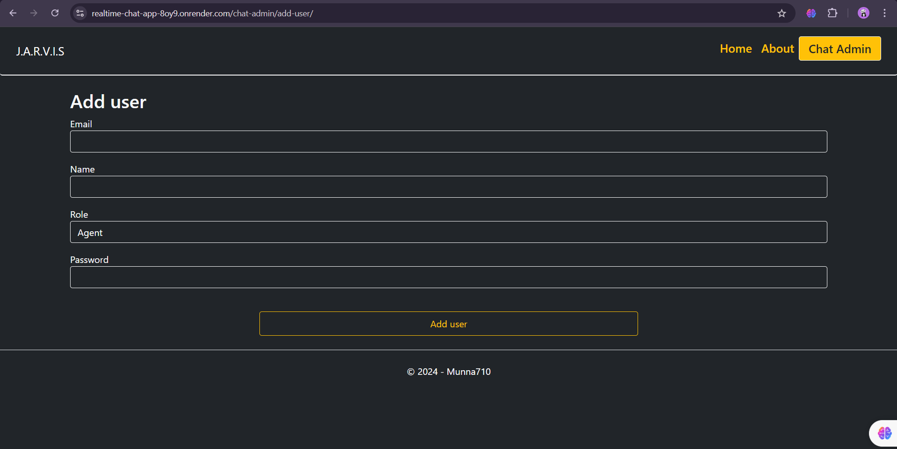
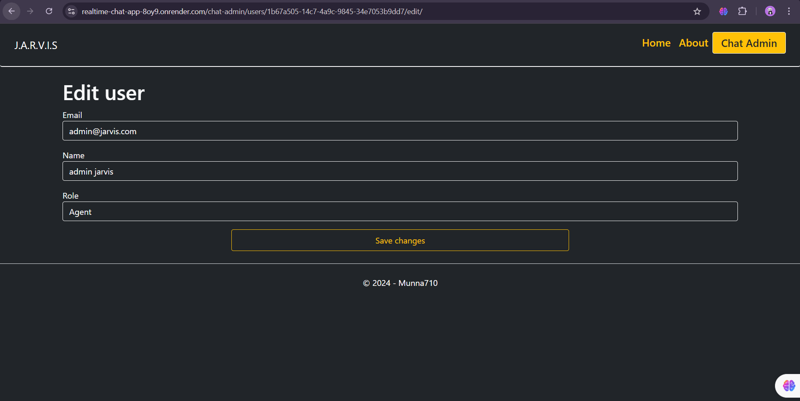
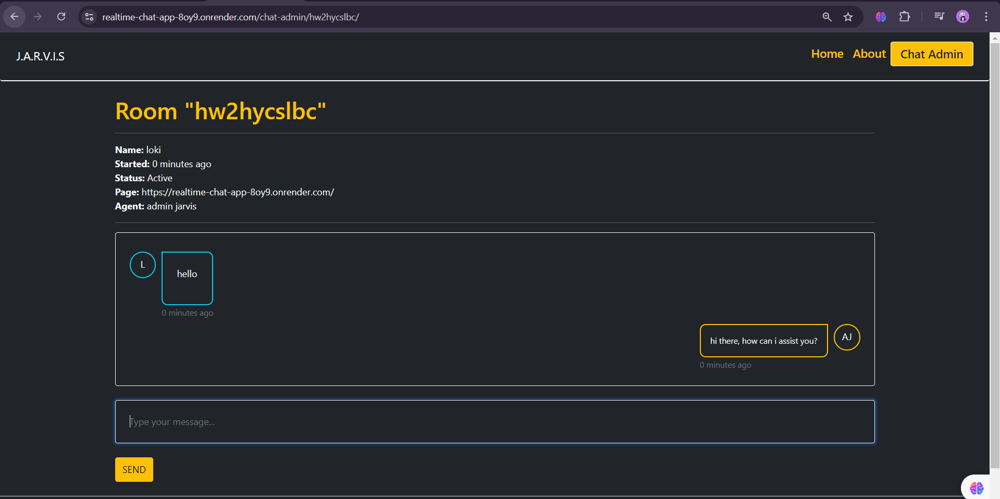

# Realtime Chat App

This is a realtime chat application built with Django and WebSockets. The application allows users to join chat rooms and communicate in real-time.

## Features

- Realtime messaging using WebSockets
- Multiple chat rooms
- User authentication
- CSRF protection

## Installation

1. Clone the repository:

    ```sh
    git clone https://github.com/yourusername/realtime-chat-app.git
    cd realtime-chat-app/djangochat
    ```

2. Create a virtual environment and activate it:

    ```sh
    python -m venv venv
    source venv/bin/activate  # On Windows use `venv\Scripts\activate`
    ```

3. Install the dependencies:

    ```sh
    pip install -r requirements.txt
    ```

4. Apply the migrations:

    ```sh
    python manage.py migrate
    ```

5. Create a superuser:

    ```sh
    python manage.py createsuperuser
    ```

6. Run the development server:

    ```sh
    python manage.py runserver
    ```

## Usage

1. Open your browser and go to `http://127.0.0.1:8000/`.
2. Log in with your superuser credentials.
3. Create a new chat room.
4. Join the chat room and start messaging.

## Deployed Application

You can access the deployed application at https://realtime-chat-app-8oy9.onrender.com/.


## shots






